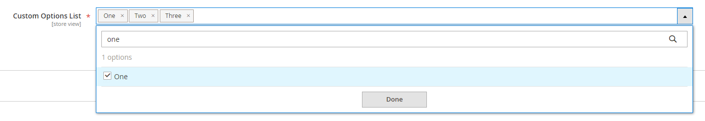

# Adding a multiselect attribute to a category



## 1. Create the attribute

Create the attribute using a data patch. **Make sure to include the backend model for the attribute so that the attribute value is saved as a comma-separated string.**

`TomasSlekys/CategoryMultiselectAttribute/Setup/Patch/Data/AddMultiselectAttributeCategoryAttribute.php`

```php
<?php

declare(strict_types=1);

namespace TomasSlekys\CategoryMultiselectAttribute\Setup\Patch\Data;

use Magento\Catalog\Model\Category;
use Magento\Eav\Model\Entity\Attribute\ScopedAttributeInterface;
use Magento\Eav\Setup\EavSetup;
use Magento\Eav\Setup\EavSetupFactory;
use Magento\Framework\Setup\ModuleDataSetupInterface;
use Magento\Framework\Setup\Patch\DataPatchInterface;
use Magento\Framework\Setup\Patch\PatchRevertableInterface;

class AddMultiselectAttributeCategoryAttribute implements DataPatchInterface, PatchRevertableInterface
{

    /**
     * Constructor
     *
     * @param ModuleDataSetupInterface $moduleDataSetup
     * @param EavSetupFactory $eavSetupFactory
     */
    public function __construct(
        private readonly ModuleDataSetupInterface $moduleDataSetup,
        private readonly EavSetupFactory $eavSetupFactory
    ) {

    }

    /**
     * @inheritdoc
     */
    public function apply(): void
    {
        $this->moduleDataSetup->getConnection()->startSetup();
        /** @var EavSetup $eavSetup */
        $eavSetup = $this->eavSetupFactory->create(['setup' => $this->moduleDataSetup]);
        $eavSetup->addAttribute(
            Category::ENTITY,
            'multiselect_attribute',
            [
                'type' => 'varchar',
                'label' => 'Multiselect Attribute',
                'input' => 'multiselect',
                'sort_order' => 333,
                'source' => 'TomasSlekys\CategoryMultiselectAttribute\Model\Category\Attribute\Source\MultiselectAttribute',
                'global' => ScopedAttributeInterface::SCOPE_STORE,
                'visible' => true,
                'required' => false,
                'user_defined' => false,
                'default' => null,
                'group' => 'General Information',
                'backend' => 'Magento\Eav\Model\Entity\Attribute\Backend\ArrayBackend'
            ]
        );

        $this->moduleDataSetup->getConnection()->endSetup();
    }

    /**
     * @inheritdoc
     */
    public function revert(): void
    {
        $this->moduleDataSetup->getConnection()->startSetup();
        /** @var EavSetup $eavSetup */
        $eavSetup = $this->eavSetupFactory->create(['setup' => $this->moduleDataSetup]);
        $eavSetup->removeAttribute(Category::ENTITY, 'multiselect_attribute');

        $this->moduleDataSetup->getConnection()->endSetup();
    }

    /**
     * @inheritdoc
     */
    public function getAliases(): array
    {
        return [];
    }

    /**
     * @inheritdoc
     */
    public static function getDependencies(): array
    {
        return [

        ];
    }
}
```

## 2. Create the attribute source model

Create the attribute source model that will provide the options for the multiselect attribute

`TomasSlekys/CategoryMultiselectAttribute/Model/Category/Attribute/Source/MultiselectAttribute.php`

```php
<?php

declare(strict_types=1);

namespace TomasSlekys\CategoryMultiselectAttribute\Model\Category\Attribute\Source;

use Magento\Eav\Model\Entity\Attribute\Source\AbstractSource;

class MultiselectAttribute extends AbstractSource
{
    /**
     * getAllOptions
     *
     * @return array
     */
    public function getAllOptions(): array
    {
        if ($this->_options === null) {
            $this->_options = [
                ['value' => 1, 'label' => __('One')],
                ['value' => 2, 'label' => __('Two')],
                ['value' => 3, 'label' => __('Three')]
            ];
        }
        return $this->_options;
    }
}
```

## 3. Add the attribute to the category form

Add the attribute to the category form using the `category_form.xml` layout file. Adjust configuration as needed.

`TomasSlekys/CategoryMultiselectAttribute/view/adminhtml/ui_component/category_form.xml`

```xml
<?xml version="1.0" ?>
<form xmlns:xsi="http://www.w3.org/2001/XMLSchema-instance" xsi:noNamespaceSchemaLocation="urn:magento:module:Magento_Ui:etc/ui_configuration.xsd">
    <fieldset name="general">
        <field name="multiselect_attribute">
            <argument name="data" xsi:type="array">
                <item name="options" xsi:type="object">TomasSlekys\CategoryMultiselectAttribute\Model\Category\Attribute\Source\MultiselectAttribute</item>
                <item name="config" xsi:type="array">
                    <item name="additionalClasses" xsi:type="string">required</item>
                    <item name="dataType" xsi:type="string">text</item>
                    <item name="label" xsi:type="string" translate="true">Custom Options List</item>
                    <item name="componentType" xsi:type="string">field</item>
                    <item name="formElement" xsi:type="string">select</item>
                    <item name="component" xsi:type="string">Magento_Ui/js/form/element/ui-select</item>
                    <item name="elementTmpl" xsi:type="string">ui/grid/filters/elements/ui-select</item>
                    <item name="dataScope" xsi:type="string">multiselect_attribute</item>
                    <item name="filterOptions" xsi:type="boolean">true</item>
                    <item name="showCheckbox" xsi:type="boolean">true</item>
                    <item name="disableLabel" xsi:type="boolean">true</item>
                    <item name="multiple" xsi:type="boolean">true</item>
                    <item name="levelsVisibility" xsi:type="number">1</item>
                    <item name="sortOrder" xsi:type="number">70</item>
                    <item name="required" xsi:type="boolean">true</item>
                    <item name="validation" xsi:type="array">
                        <item name="required-entry" xsi:type="boolean">false</item>
                    </item>
                    <item name="listens" xsi:type="array">
                        <item name="${ $.namespace }.${ $.namespace }:responseData" xsi:type="string">setParsed</item>
                    </item>
                </item>
            </argument>
        </field>
    </fieldset>
</form>
```

## 4. Create category data provider plugin

Create a plugin for the `Magento\Catalog\Model\Category\DataProvider` class to convert the multiselect attribute value from a string to an array

`TomasSlekys/CategoryMultiselectAttribute/etc/di.xml`

```xml
<?xml version="1.0"?>
<config xmlns:xsi="http://www.w3.org/2001/XMLSchema-instance" xsi:noNamespaceSchemaLocation="urn:magento:framework:ObjectManager/etc/config.xsd">
    <type name="Magento\Catalog\Model\Category\DataProvider">
        <plugin name="TomasSlekys_CategoryMultiselectAttribute_Plugin_Magento_Catalog_Model_Category_DataProvider" type="TomasSlekys\CategoryMultiselectAttribute\Plugin\Magento\Catalog\Model\Category\DataProviderPlugin"/>
    </type>
</config>
```

`TomasSlekys/CategoryMultiselectAttribute/Plugin/Magento/Catalog/Model/Category/DataProviderPlugin.php`

```php
<?php

declare(strict_types=1);

namespace TomasSlekys\CategoryMultiselectAttribute\Plugin\Magento\Catalog\Model\Category;

use Magento\Catalog\Model\Category\DataProvider;
use Magento\Framework\Exception\NoSuchEntityException;

class DataProviderPlugin
{
    /**
     * @param DataProvider $subject
     * @param $result
     * @return array
     * @throws NoSuchEntityException
     */
    public function afterGetData(DataProvider $subject, $result): array
    {
        if ($category = $subject->getCurrentCategory()) {
            if (isset($result[$category->getId()]['multiselect_attribute'])) {
                $categoryData = &$result[$category->getId()];
                $categoryData['multiselect_attribute'] = explode(',', $categoryData['multiselect_attribute']);
            }
        }

        return $result;
    }
}
```