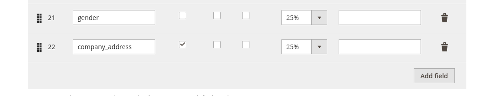
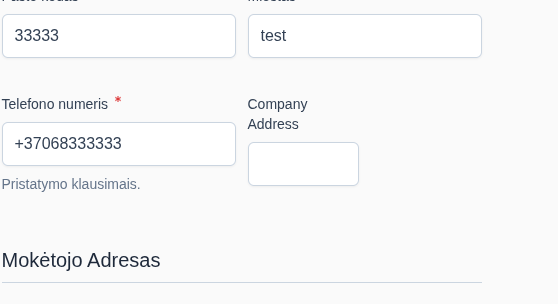

# Adding new fields to the Hyva Checkout Address Form

Create a EAV attribute for the 'customer_address' entity type via data patch. The field will appear in the Hyva Checkout Address form automatically.
It can now be configured in the Hyva Checkout configuration in the admin panel.

For example, to add a new field called 'company_address':

`TomasSlekys/CompanyFields/Setup/Patch/Data/AddCompanyAddressAddressAttribute.php`

```php
<?php

declare(strict_types=1);

namespace TomasSlekys\CompanyFields\Setup\Patch\Data;

use Magento\Eav\Setup\EavSetup;
use Magento\Eav\Setup\EavSetupFactory;
use Magento\Framework\Exception\LocalizedException;
use Magento\Framework\Setup\ModuleDataSetupInterface;
use Magento\Framework\Setup\Patch\DataPatchInterface;
use Magento\Framework\Setup\Patch\PatchRevertableInterface;
use Magento\Framework\Validator\ValidateException;

class AddCompanyAddressAddressAttribute implements DataPatchInterface, PatchRevertableInterface
{
    public function __construct(
        protected ModuleDataSetupInterface $moduleDataSetup,
        protected EavSetupFactory $eavSetupFactory
    ) {
    }

    /**
     * @return void
     * @throws LocalizedException
     * @throws ValidateException
     * @author TomasSlekys
     */
    public function apply(): void
    {
        $this->moduleDataSetup->getConnection()->startSetup();
        /** @var EavSetup $eavSetup */
        $eavSetup = $this->eavSetupFactory->create(['setup' => $this->moduleDataSetup]);
        $eavSetup->addAttribute(
            'customer_address',
            'company_address',
            [
                'type' => 'varchar',
                'label' => 'Company Address',
                'input' => 'text',
                'source' => '',
                'frontend' => '',
                'required' => false,
                'backend' => '',
                'default' => null,
                'user_defined' => true,
                'unique' => false,
                'group' => 'General',
            ]
        );

        $this->moduleDataSetup->getConnection()->endSetup();
    }

    /**
     * @return void
     * @author TomasSlekys
     */
    public function revert(): void
    {
        $this->moduleDataSetup->getConnection()->startSetup();
        /** @var EavSetup $eavSetup */
        $eavSetup = $this->eavSetupFactory->create(['setup' => $this->moduleDataSetup]);
        $eavSetup->removeAttribute('customer_address', 'company_address');

        $this->moduleDataSetup->getConnection()->endSetup();
    }

    /**
     * @return string[]
     * @author TomasSlekys
     */
    public function getAliases(): array
    {
        return [];
    }

    /**
     * @return string[]
     * @author TomasSlekys
     */
    public static function getDependencies(): array
    {
        return [];
    }
}
```

The field should now appear in the configuration:



As well as the checkout address form:

